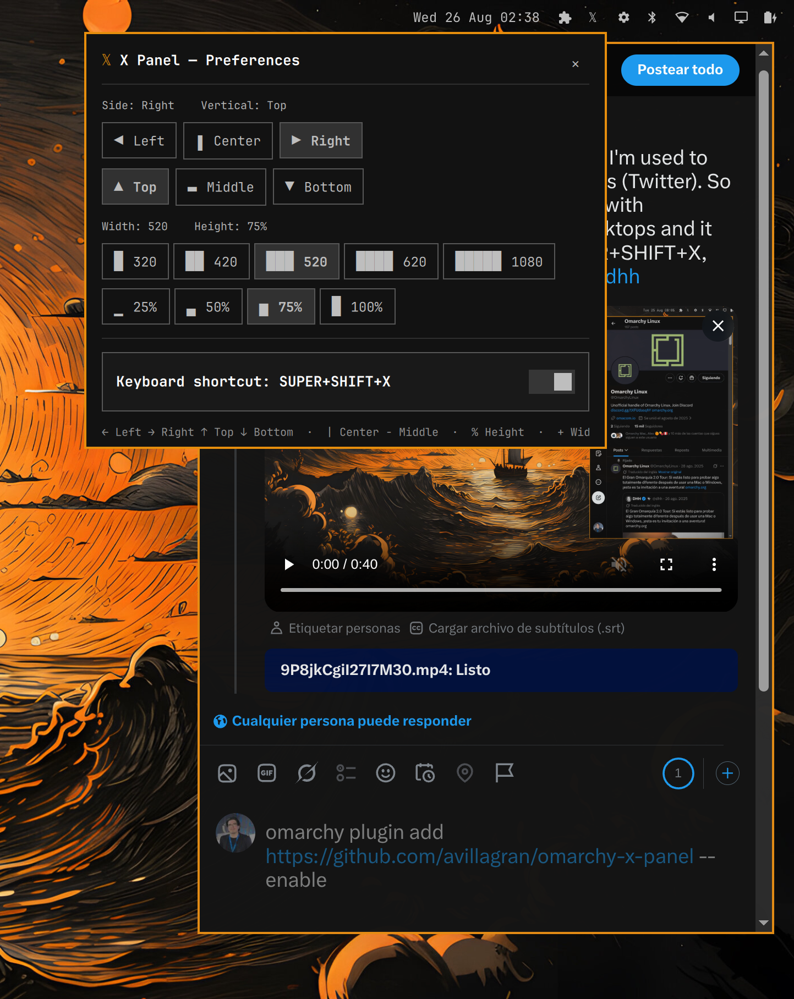

# X Panel

Opera-GX style always-on **X (Twitter) side panel** for [Omarchy](https://github.com/Omarchy/omarchy) (Quickshell / Hyprland).

The panel **is your existing X window** — it is never a second Chromium instance. If an X window is already open it is reused; otherwise one is launched with your native profile. It is pinned (visible on every workspace) and floating at a configurable position and size, toggled from the bar icon or `SUPER+SHIFT+X` without ever closing the window, so the session and scroll position are preserved.

## Screenshot



## Features

- One persistent, always-on X window (your real session, not a separate login).
- Toggle show / hide from the bar icon or `SUPER+SHIFT+X` — hiding keeps the session alive.
- Pinned + floating on all workspaces.
- Preferences panel (right-click the bar icon) anchored under the icon, with live apply:
  - **Side**: Left / Center / Right
  - **Vertical**: Top / Middle / Bottom
  - **Width**: 320 / 420 / 520 / 620 / 1080 px
  - **Height**: 25% / 50% / 75% / 100% of the safe area
- Multi-language UI — 19 languages (en, es, pt, fr, de, it, nl, pl, ru, ja, ko, zh, ar, tr, sv, da, no, fi, cs), auto-detected from the OS locale (`localectl`).
- UI matching the Omarchy Control Panel style (header, sections, separators).

## Installation

```bash
omarchy plugin add https://github.com/avillagran/omarchy-x-panel --enable
```

That is all. The plugin (including its helper script under `bin/`) is resolved relative to its own location, so it works on any machine with no extra steps. Reload the shell if it does not pick up the new widget immediately:

```bash
omarchy-restart-shell
```

### Keyboard shortcut

The plugin can bind `SUPER+SHIFT+X` to toggle the panel, replacing Omarchy's
default X webapp bind (which relaunches a fresh window every time). This is
**opt-in**: the plugin never touches your Hyprland config on install or load.
Open the preferences panel (right-click the bar icon) and switch on *Keyboard
shortcut* — only then does the plugin write `~/.config/hypr/x-panel-bindings.lua`
and append a single `require("x-panel-bindings")` line to
`~/.config/hypr/hyprland.lua` (idempotent, atomic writes). Switching it off
removes both and restores Omarchy's default bind.

## Usage

- **Left-click** the `𝕏` bar icon (or `SUPER+SHIFT+X`): toggle the X window.
- **Right-click** the `𝕏` bar icon: open the preferences panel (position / size), applied live.
- The preferences panel **stays open and on top** while you pick options, so you can preview each change live (the X window sits behind it) — close it with the `✕` in the top-right corner.

## How it works

- Identity is tracked as `address|pid` in `/run/user/1001/x-panel.state`.
- Layout is computed against the **safe area** (the monitor minus the Quickshell bar strip), so the panel never covers the bar.
- Preferences are persisted at `/run/user/1001/omarchy-x-panel.prefs.json` (outside the plugin directory, so writing them never triggers a plugin reload) and applied live via the bundled helper script. All state writes use exclusive `mktemp` + atomic `mv`, and every external read is bounded (`timeout 5 head -c`).
- Launching uses the same `.desktop` entry as `SUPER+SPACE` → Apps → X (`uwsm-app -- X.desktop`), so a cold start opens the real X webapp — never a plain browser window.

## Uninstall

```bash
omarchy plugin remove io.github.avillagran.omarchy-x-panel
```

Then delete the generated keybind file and its require line to restore Omarchy's
default X bind:

```bash
rm -f ~/.config/hypr/x-panel-bindings.lua
sed -i '/require("x-panel-bindings")/d' ~/.config/hypr/hyprland.lua
hyprctl reload
```

## License

MIT — see [LICENSE](LICENSE).
